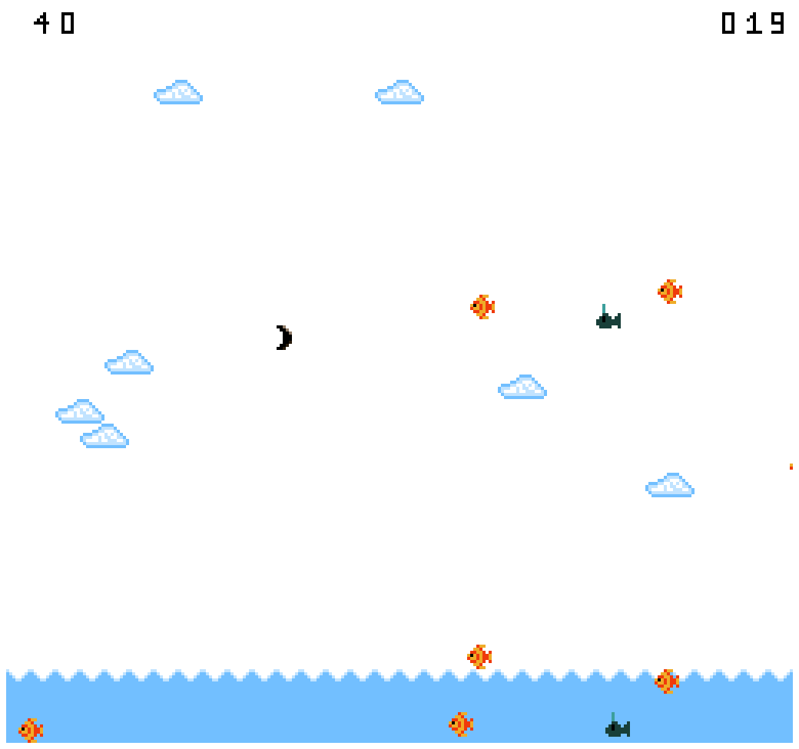

# Akuaman Simulator

Author: Xiaoqiao Xu, Zhengyang Xia, Zizhuo Lin

Design: This game allows the player to aim with a boomerang, which has a simple mechanism but is quite uncommon as a projectile in most games. It combines an easy and intuitive mechanism of control with our state-of-the-artfor 1980 physics engine.

Screen Shot:

How Your Asset Pipeline Works:

(TODO: describe the steps in your asset pipeline, from source files to tiles/backgrounds/whatever you upload to the PPU466.)

How To Play:

Press and hold the space bar and release to throw the boomerang. Aim for fishes and whales, but not bombs. Try to get the higest score in a limited amount of time!

Sources: N/A

This game was built with [NEST](NEST.md).

Disclaimer: this game is definitely about Akuaman, not Aquaman.

å