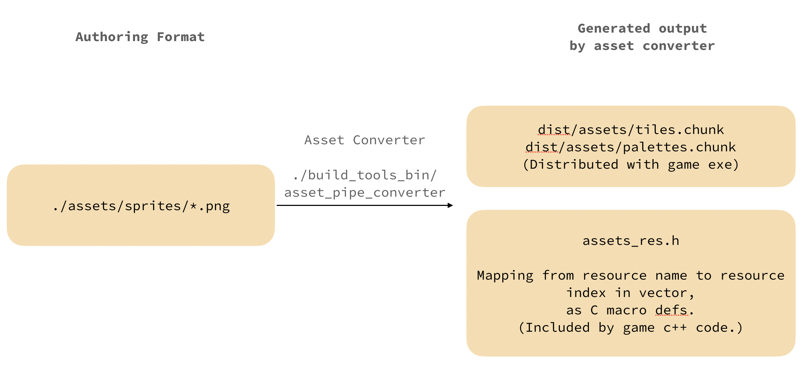

# Akuaman Simulator

Author: Xiaoqiao Xu, Zhengyang Xia, Zizhuo Lin

Design: This game allows the player to aim with a boomerang, which has a simple mechanism but is quite uncommon as a projectile in most games. It combines an easy and intuitive mechanism of control with our state-of-the-art for 1980s physics engine.

Screen Shot:

How Your Asset Pipeline Works:

* __authoring format__: In this game, we only have one type of asset: images. We choose `png` as the authoring format, and place it as `./assets/sprites/*.png`.
* __converted output__:
    * `dist/assets/tiles.chunk` and `dist/assets/palettes.chunk` contains a serialized version of `vector<Tile>` or `vector<Palette>`, using `read_write_chunk()` API.
    * `generated/include/assets_res.h` is a generated C header file, that contains the mapping from `resource-name` to `index-within-the-chunk-file`. It's included by other game source files.
    
The trick of `assets_res.h` is using C macros to maintain the resource-name to index mapping. For example, if we have a `boomerang.png` and its' palette index 0. Then the `assets_res.h` would have `#define BOOMERANG_PALETTE_IDX 1`. Whenever the game code want to reference the boomerang, it uses that macro definition.

How To Play:

Press and hold the space bar and release to throw the boomerang. Aim for fishes and whales, but not bombs. Try to get the higest score in a limited amount of time!

Sources: N/A

This game was built with [NEST](NEST.md).

Disclaimer: this game is definitely about Akuaman, not Aquaman.